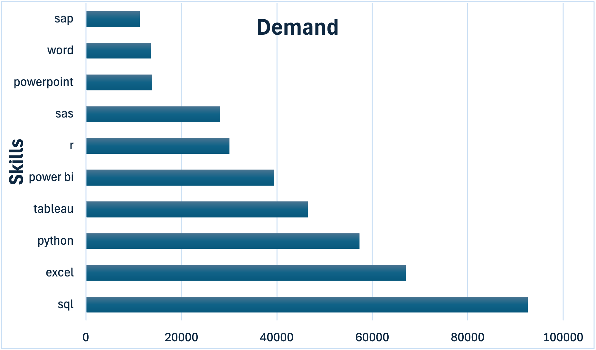

# Introduction

Diving into the data job market, this project focuses on data analys roles where I explore top-paying jobs, in-demand skills, and where high demand meets high salary in data analytics. 

My SQL Queries are here [Project_sql folder](/SQL_project/Proect_sql
)

# Background

Driven by a goal to navigate the data analyst job market more efficiently, this project aimed to pinpoint top-paid and in0demand skills, streamling otherd work to find optimal jobs. 

### The questions I wanted to answer through my SQL query were:

1. What are the top-paying data analyst jobs?
2. What skills are required for these top-paying jobs?
3. What skills are most in demand for data analysts?
4. Which skills are associated with higher salaries?
5. What are the most optimal skills to learn?

## Data Source


Data is sourced from Luke Barousse's [SQL course](/https://www.lukebarousse.com/courses). 
The dataset used in this project contains data science job postings from 2023. 
It includes information about job titles, salaries, companies, locations, and required skills.

The dataset is organized into multiple tables including job postings, companies, and skills, 
allowing analysis of salary trends and in-demand skills in the data analyst job market.

# Tools I used

For my deep dive into the data analyst job market, I utilized several key tools:

- **SQL:** The backbone of my analysis, allowing me to query the database and identify critical insights. 
- **PostgreSQL:** The chosen database management system, ideal for handling the job posting data. 
- **Visual Studio Code:**: My go-to for database management and executing SQL queries. 
- **Git & GitHub:** Essential for version control and sharing my SQL scripts and analysis, ensuring collaboration and project tracking. 

# The Analysis

## 1. Top Paying Data Analyst Jobs

This query identifies the highest paying remote Data Analyst roles by filtering for jobs with specified salaries and ordering them from highest to lowest.

``` SQL    
SELECT
    job_id,
    job_title,
    job_location,
    job_schedule_type,
    salary_year_avg,
    job_posted_date,
    name AS company_name
FROM
    job_postings_fact
LEFT JOIN company_dim ON job_postings_fact.company_id = company_dim.company_id
WHERE 
    job_title_short = 'Data Analyst' AND
    job_location= 'Anywhere'AND
    salary_year_avg IS NOT NULL
ORDER BY 
    salary_year_avg DESC
LIMIT 10

```
### Key Insights

- **Wide Salary Range:** The top 10 highest-paying data analyst roles range from $184,000 to $650,000, highlighting the strong earning potential within the field.

- **Diverse Employers:** Companies such as SmartAsset, Meta, and AT&T appear among the top-paying employers, indicating demand for data analysts across multiple industries.

- **Variety of Roles:** Job titles range from Data Analyst to Director of Analytics, reflecting the wide range of positions and specializations within the data analytics field.


## 2. Skills Required for Top Paying Jobs

After identifying the top-paying roles, the next step was to determine which skills appear most frequently in those job postings.

``` SQL

WITH top_paying_jobs AS (
SELECT
    job_id,
    job_title,
    salary_year_avg,
    name AS company_name
FROM
    job_postings_fact
LEFT JOIN company_dim ON job_postings_fact.company_id = company_dim.company_id
WHERE 
    job_title_short = 'Data Analyst' AND
    job_location= 'Anywhere'AND
    salary_year_avg IS NOT NULL
ORDER BY 
    salary_year_avg DESC
LIMIT 10
)

SELECT 
    top_paying_jobs.*,
    skills
    FROM top_paying_jobs
    INNER JOIN skills_job_dim ON top_paying_jobs.job_id = skills_job_dim.job_id
    INNER JOIN skills_dim ON skills_job_dim.skill_id = skills_dim.skill_id
ORDER BY 
    salary_year_avg DESC
```

### Key Insights

- SQL appears in many of the highest-paying roles.

- Programming languages like Python and R are also common.

- Visualization tools such as Tableau are frequently required.

- This shows that strong data querying, programming, and visualization skills are critical for high-paying analytics roles.

## 3. Most In-Demand Skills for Data Analysts

This analysis counts how often each skill appears across job postings.

```SQL

WITH jobs_and_skills AS
(
    SELECT 
        job_postings_fact.job_id,
        skills     
    FROM job_postings_fact
    INNER JOIN skills_job_dim ON job_postings_fact.job_id = skills_job_dim.job_id
    INNER JOIN skills_dim ON skills_job_dim.skill_id = skills_dim.skill_id
        WHERE job_title_short = 'Data Analyst'

)

SELECT 
    skills, COUNT (*) AS total_demand
FROM jobs_and_skills

GROUP BY skills
ORDER BY total_demand DESC
LIMIT 5
```
### Key Insights
- **Foundational Tools:** SQL and Excel remain core skills for data analysts, highlighting the importance of strong abilities in data querying, processing, and spreadsheet analysis.

- **Technical & Visualization Skills:** Tools such as Python, Tableau, and Power BI are increasingly valuable, reflecting the growing role of technical analysis and data visualization in supporting business decisions.




## 4. Skills Associated With Higher Salaries

This query calculates the average salary associated with each skill.

```sql
SELECT  
    skills,
   ROUND( AVG(salary_year_avg), 0) AS avg_salary 
    
FROM job_postings_fact
    INNER JOIN skills_job_dim ON job_postings_fact.job_id = skills_job_dim.job_id
    INNER JOIN skills_dim ON skills_job_dim.skill_id = skills_dim.skill_id
WHERE 
    salary_year_avg IS NOT NULL AND 
    job_title_short = 'Data Analyst'
GROUP BY skills
ORDER BY avg_salary DESC
LIMIT 25
``` 
### Key Insights

- **High Demand for Big Data & Machine Learning Skills:** Tools such as PySpark, Couchbase, DataRobot, Jupyter, Pandas, and NumPy are associated with higher salaries, highlighting the value of skills in large-scale data processing and predictive modeling.

- **Data Engineering & Automation Skills:** Knowledge of tools like GitLab, Kubernetes, and Airflow shows the increasing overlap between data analysis and data engineering, where automation and efficient data pipeline management are highly valued.

- **Cloud & Modern Data Infrastructure:** Familiarity with platforms such as Elasticsearch, Databricks, and Google Cloud Platform (GCP) emphasizes the growing importance of cloud-based analytics environments in modern data workflows.

## 5. Most Optimal Skills to Learn

This final analysis combines skill demand and average salary to determine the most valuable skills to learn.

```sql
WITH skills_demand AS (
    SELECT 
        skills_dim.skill_id,
        skills_dim.skills,
        COUNT(*) AS total_demand  -- number of job postings requiring this skill
    FROM job_postings_fact
    INNER JOIN skills_job_dim 
        ON job_postings_fact.job_id = skills_job_dim.job_id
    INNER JOIN skills_dim 
        ON skills_job_dim.skill_id = skills_dim.skill_id
    WHERE 
        job_title_short = 'Data Analyst'
        AND salary_year_avg IS NOT NULL
    GROUP BY 
        skills_dim.skill_id, skills_dim.skills
),

average_salary AS (
    SELECT  
        skills_job_dim.skill_id,
        ROUND(AVG(salary_year_avg),0) AS avg_salary  -- average salary per skill
    FROM job_postings_fact
    INNER JOIN skills_job_dim 
        ON job_postings_fact.job_id = skills_job_dim.job_id
    WHERE 
        salary_year_avg IS NOT NULL
        AND job_title_short = 'Data Analyst'
    GROUP BY 
        skills_job_dim.skill_id
)

SELECT
    skills_demand.skill_id,
    skills_demand.skills,
    total_demand,
    avg_salary
FROM skills_demand
INNER JOIN average_salary 
    ON skills_demand.skill_id = average_salary.skill_id
WHERE total_demand >10
ORDER BY 
    total_demand DESC,
    avg_salary DESC;

```

### Key Insights
- **Big Data & Machine Learning Skills:** High salaries are often associated with skills in PySpark, Couchbase, DataRobot, Jupyter, Pandas, and NumPy, highlighting the strong demand for expertise in large-scale data processing and predictive analytics.

- **Data Engineering & Automation Tools:** Knowledge of tools such as GitLab, Kubernetes, and Airflow reflects the growing overlap between data analytics and data engineering, where automation and efficient data pipeline management are highly valued.

- **Cloud & Modern Data Platforms:** Familiarity with platforms like Elasticsearch, Databricks, and Google Cloud Platform (GCP) emphasizes the increasing importance of cloud-based analytics environments in modern data workflows.

# What I Learned

Throughout this project, I strengthened my SQL skills by analyzing real-world data job postings and extracting meaningful insights from the dataset.

### Advanced SQL Techniques

- Used **Common Table Expressions** (CTEs) to break down complex queries into more readable steps.

- Applied **JOIN operations** to combine multiple tables and analyze relationships between job postings and required skills.

- Practiced **aggregation functions** like COUNT() and AVG() to summarize job market trends.

### Data Analysis Thinking

- Learned how to approach a dataset by starting with **clear analytical questions.**

- Explored how to identify **patterns in job demand and salary distribution.**

- Understood how data can be used to guide **career decisions and skill development.**

### Real-World Insights

- Discovered which technical skills are most valuable in the data analyst job market.

- Learned how to interpret data to identify high-demand and high-paying skills.

- Practiced communicating insights through clear explanations and structured analysis.

# Conclusions

This analysis provided valuable insights into the data analyst job market by examining job postings, required skills, and salary trends.

The results show that **SQL remains the most essential skill for data analysts**, appearing frequently across job postings and being required for many high-paying roles. Programming languages like **Python** and visualization tools such as **Tableau** also play a major role in modern data analysis workflows.

Additionally, skills related to cloud platforms and data infrastructure tend to be associated with higher salaries, indicating the growing importance of working with large-scale data systems.

Overall, this project demonstrates how SQL can be used not only to query databases but also to extract actionable insights that help guide career development in the data analytics field.
